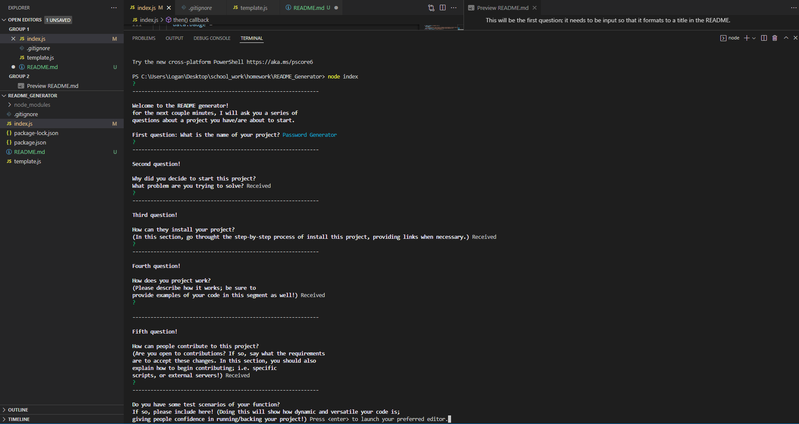

# ReadME Generator



For this assignment, we have been tasked with creating a node-based questionnaire that, in completion, will generate a file in README format. This file will display all of the users inputs and print them in a professional, comprehensive form.

## Lets break down the acceptance criteria:

```
GIVEN a command-line application that accepts user input
WHEN I am prompted for information about my application repository
THEN a high-quality, professional README.md is generated with the title of
my project and sections entitled Description, Table of Contents,
Installation, Usage, License, Contributing, Tests, and Questions.
```

Filling in the node-based questionnaire will fill in a function; this function will return a string with the given data, ultimately converting it into a README document.

### This will display as "your-README.md", not to be confused with THIS README!

```
WHEN I enter my project title
THEN this is displayed as the title of the README

WHEN I enter my project title
THEN this is displayed as the title of the README
```

This will be the first question; it needs to be input so that it formats to a title in the README.

These are all the subsequent questions we'll ask. They will also need to be input so that the template can format it.

```
WHEN I choose a license for my application from a list of options
THEN a badge for that license is added near the top of the README and a notice is added to the section of the README entitled License that explains which license the application is covered under
```

This will be an input that returns two data points; one for the badge, and the other for the license documentation. The latter will be dependent on the former.

```
WHEN I enter my GitHub username
THEN this is added to the section of the README entitled Questions, with a link to my GitHub profile

WHEN I enter my email address
THEN this is added to the section of the README entitled Questions, with instructions on how to reach me with additional questions
```

The gitHub username wil be added to a string, containing the rest of a github link. This will become a hyperlink to their git profile.

The email won't become a hyperlink; it will display as text, so that a user can reference it later on (for contributions or concerns).

```
WHEN I click on the links in the Table of Contents
THEN I am taken to the corresponding section of the README
```

The template literal will have to be formatted so that, when clicking on an element in th ToC, will direct them to the desired location.
(This will already be done in the template.)

## How To Use

Rather than being run on the browser, this will be run through NODE.js! This means you will have to open this script in the terminal with which you are currently viewing the project in.

Below is a video walking through the process of running this generator.
